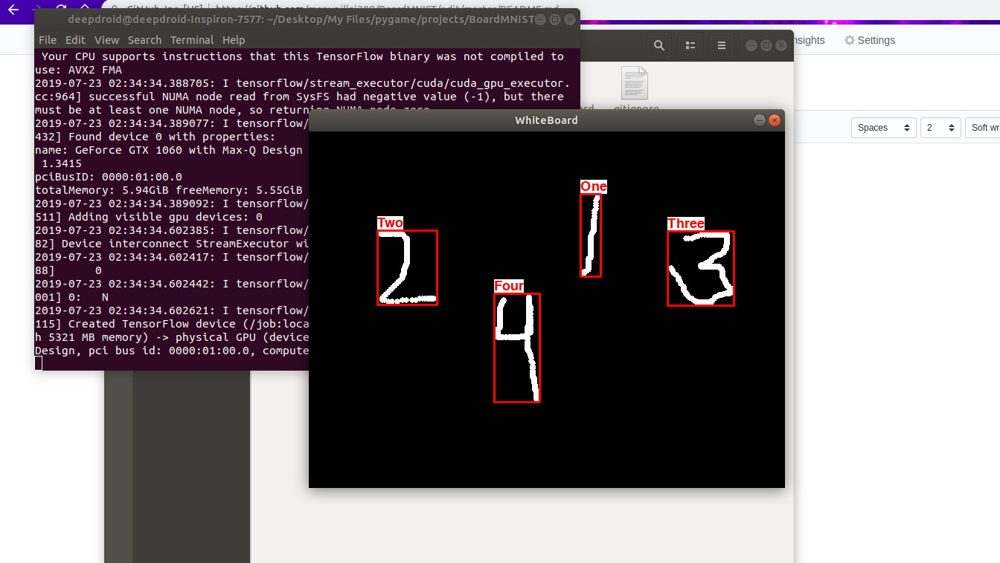

# BoardMNIST

A simple [Pygame](https://www.pygame.org/news) based MNIST digit recognition board. 

### Working



### Requirements
```
python 3.6
pygame
keras + tensorflow (only for training your own model)
opencv
```

### Usage
Just run ```whiteboard.py``` :wink:

### Additional
Here I have provided the ```jupyter notebook``` in which I have done my training of the model. The architecture is LeNet-1. You can use it to train your own model, or just use the pretrained one present in the ```/model``` folder. :smile:
